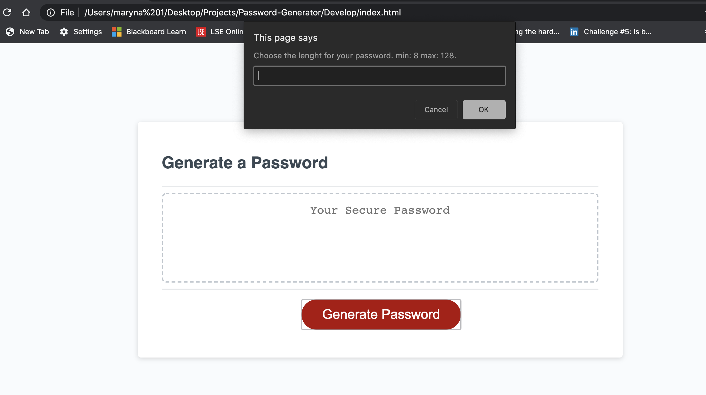
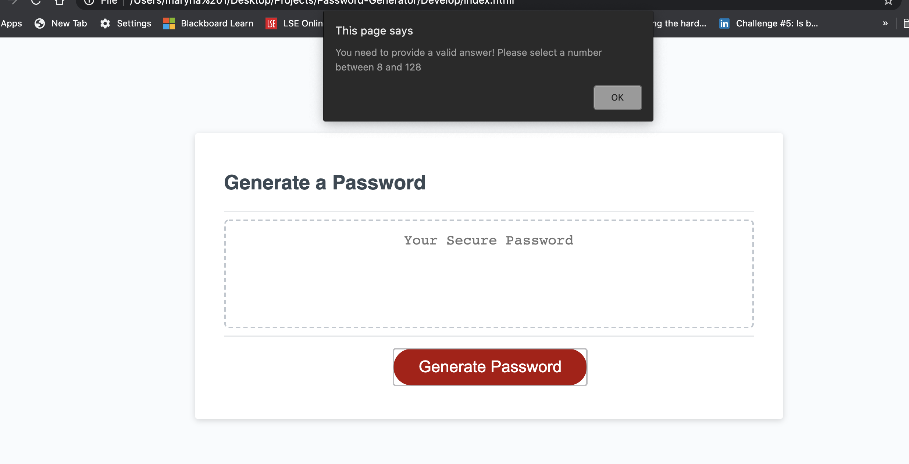
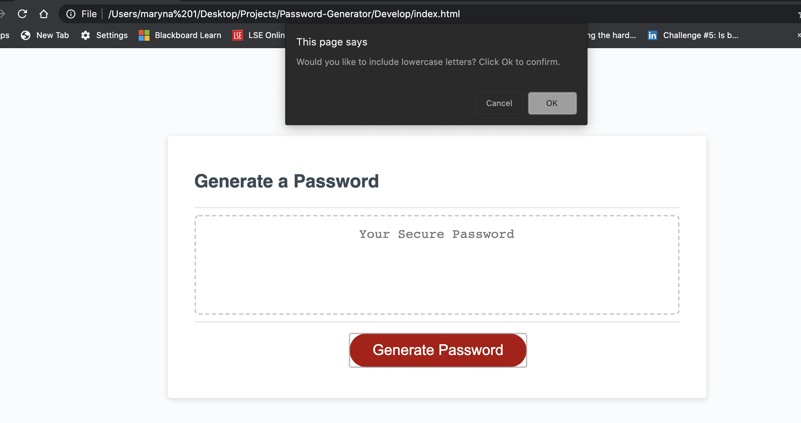
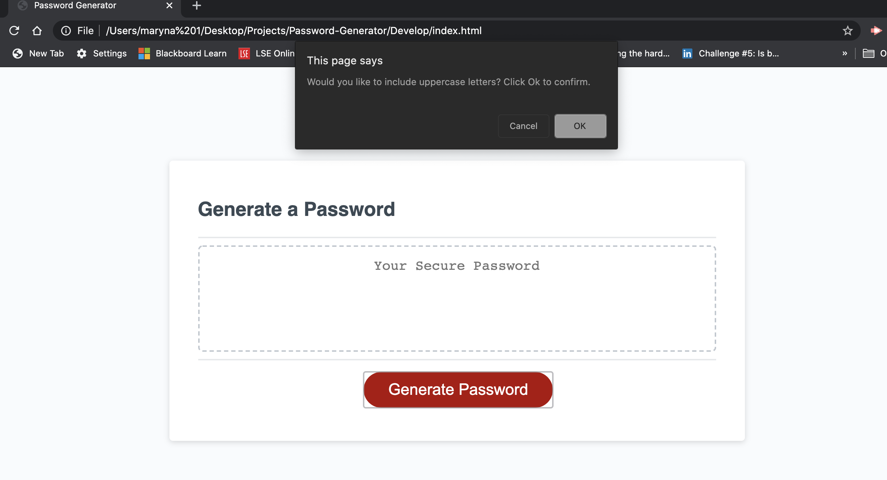
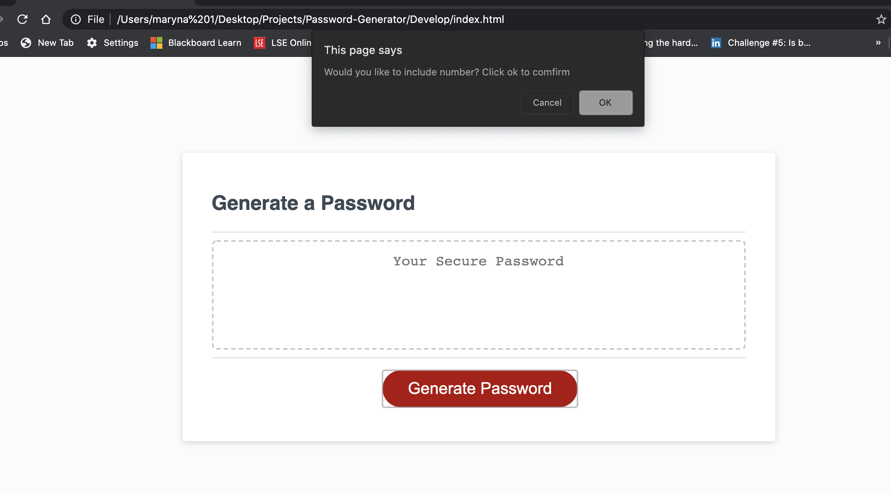
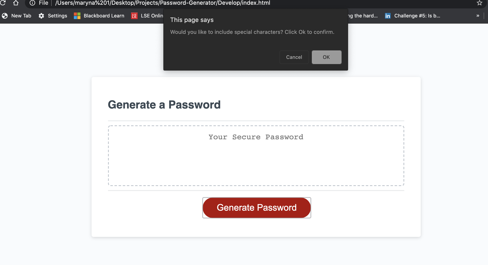

# 03 JavaScript: Password Generator

The following image demonstrates the application functionality:

# Description
This code creates an application that generates a random password based on user-selected criteria: at least 8 characters and no more than 128 characters, lowercase, uppercase, numeric, and/or special characters.

## Technology Used
* HTML5
* CSS
* JavaScript

## Web Access

Click here for the [Password-Generator] access https://marynapr.github.io/My-Password-Generator/.

This document was created by MarynaPR. Feel free to contact me with any questions via email pryadkamaryna@gmail.com
